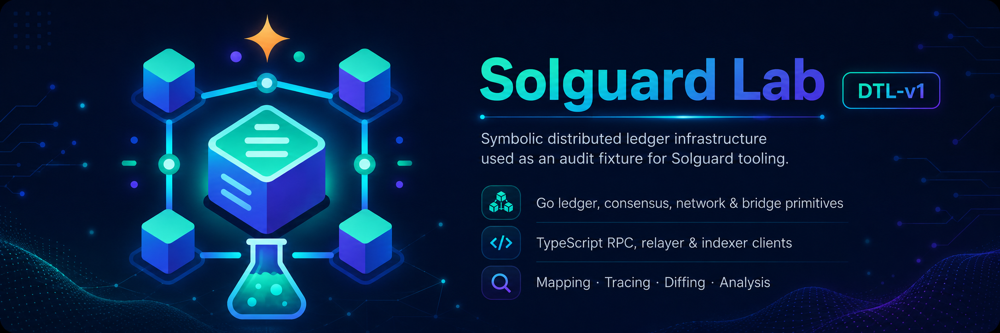

# Solguard Lab DTL-v1

Symbolic distributed ledger infrastructure used as a deterministic audit fixture for Solguard tooling.



DTL-v1 is intentionally compact, but it is organized like a real protocol repository. It gives `solguard-map`, `solguard-trace`, `solguard-diff`, `solguard-database` and `analyze` enough structure to enumerate surfaces, follow execution paths and reason about changes.

This is not a production blockchain implementation. It is a local lab for repeatable security analysis.

## Commands

```bash
go test ./...
cd ts
bun install
bun test
```

## Layout

```text
cmd/dtld/           symbolic node entrypoint
internal/           Go implementation packages
pkg/types/          shared Go protocol types
tests/              Go integration tests
ts/                 TypeScript clients and tests
docs/               architecture and operations notes
```

## Solguard Usage

Recommended analysis flow:

```bash
solguard-map .
solguard-trace .
solguard-diff .
```

Use this lab as a known target when validating whether Solguard can connect source structure, git history, deterministic traces and knowledge-base retrieval into useful audit hypotheses.
